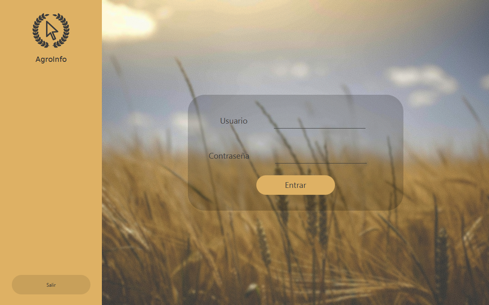
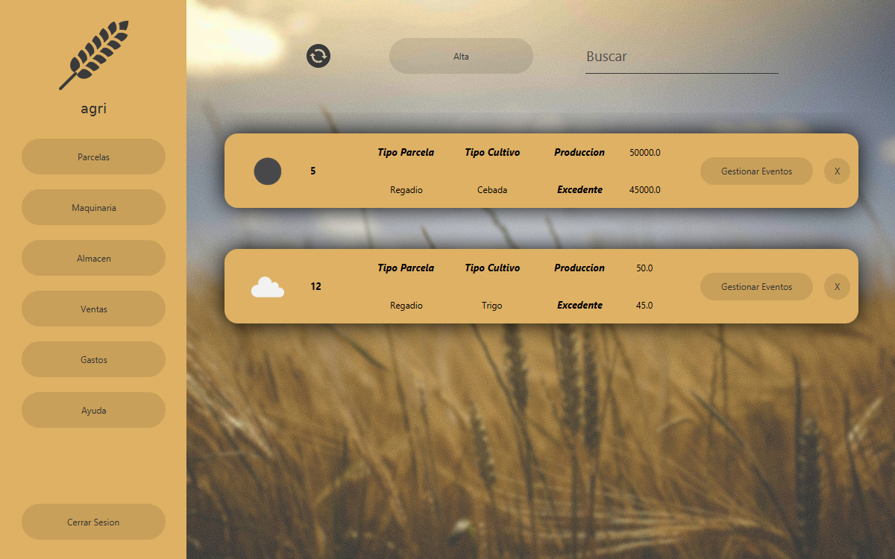
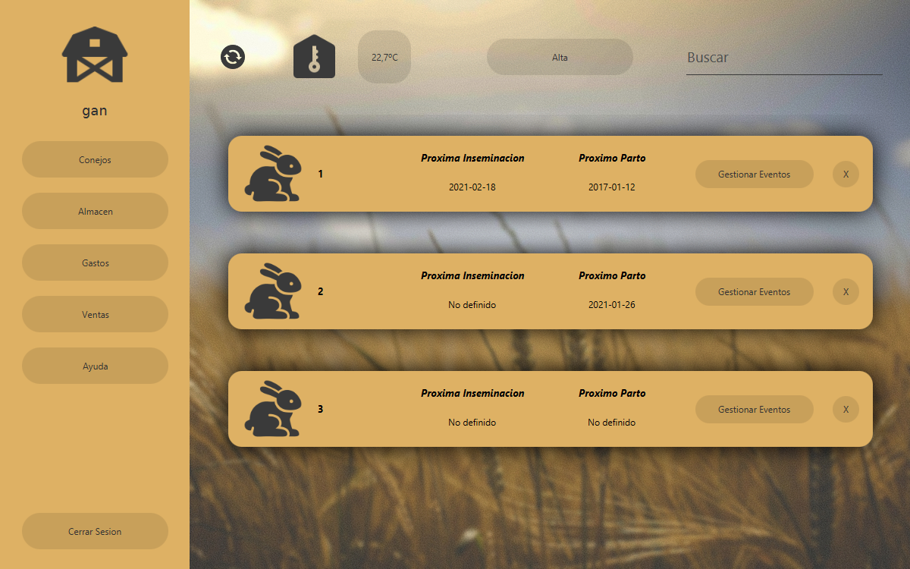

# AgroInfo
   

  

AgroInfo es una aplicación de escritorio pensada para la gestión de pequeñas y medianas explotaciones agrícolas y ganaderas.

-   Gestión de parcelas
-   Gestión de maquinaria
-   Gestión del ganado

## Tecnologías

Se ha utilizado Java con JavaFx para la UI, además de librerías como JFoenix y AwesomeFontFx

### Capturas

  
  
  

